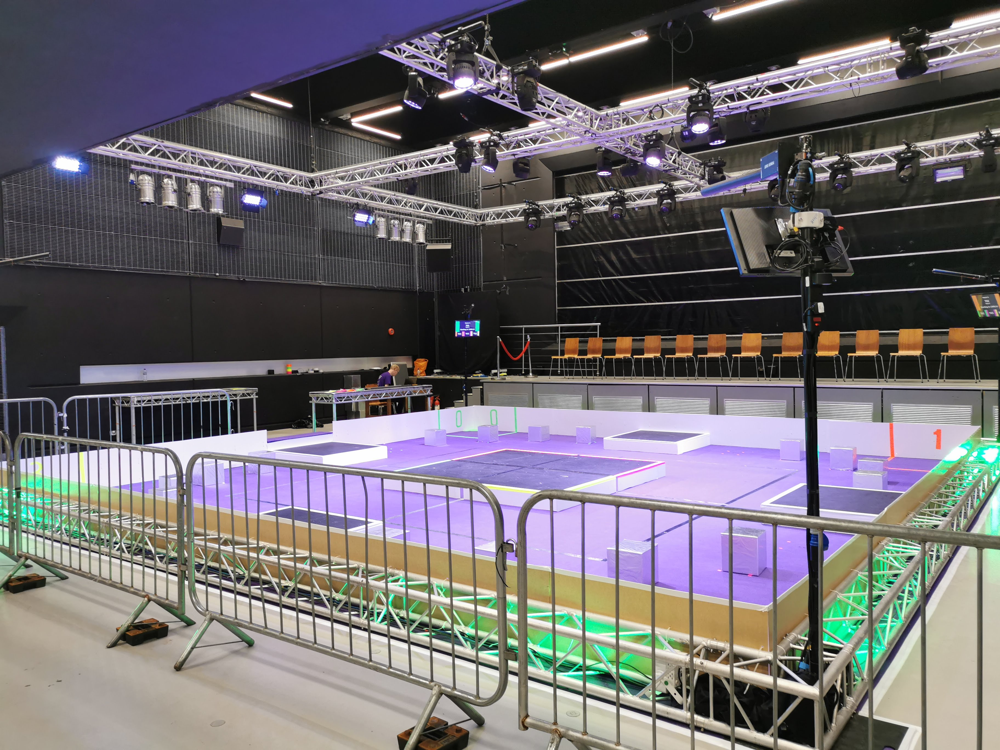

**Author: [Dan Trickey](https://trickey.io)**

Another year, another two robotics events.

The first was [Student Robotics 2019](https://studentrobotics.org), a new organisation to me, albeit very closely linked to the activities that I'd been involved in before. SR is of a much larger scale than the other events that I've helped organise before, with approximately 30 teams this year, squeezing into the same venue that we'd usually fit 10 teams in. It's safe to say that we took up just about every public space in the [SUSU](https://www.susu.org) main building during this event. SR2019 was held in April earlier this year and I was so tired afterwards that I really didn't have the energy to write a post about it back then. I will likely be making a reflective post about it as we move into the next competition cycle.

The second, and namesake of this post is one I've posted about before on here as [Smallpeice 2018](https://trickey.io/posts/smallpeice2018). Much like the previous summer school, we took a group of students (70 this year), and guided them throughout a week to build a robot to compete against each other at the end of the week.

This year, even more so than last year, I found myself doing a lot of the organisation for the event. SourceBots and [SRO](https://roboticsoutreach.org) are, on paper at least, only handling the technical activities during the week. Practically, we need to do a lot more than that. We have been fortunate this year in having amazing help from a brilliant academic at [ECS](https://ecs.soton.ac.uk), who helped us to create what has been one of the most smooth-running weeks in the 8 year history of this summer school.

## Feedback is everything

After last year, we had received some of the worst feedback from the students, indicating that we had not done things that well. Some of the areas that particularly needed focus were that during the time in the labs, students felt that they were not receiving enough support from volunteers, and that the electronics labs were nothing more than a glorified soldering exercise. 

We set out to fix the electronics labs first, rewriting them from absolute scratch, and doing it well in advance. One of the memories I have from last year is writing the electronics labs during the morning before the students were due to do them, as they were not ready. This year we were fortunate enough to have two Electronic Engineering undergraduates step up to take this on. The new labs had much more of a focus on the underlying principles, with practical exercises to demonstrate this to the students. My particular favourite activity was using an ultrasound sensor, an oscilloscope, and a signal generator to see in real time how the pulse is reflected back and how this changes with distance. The students were then able to calculate an approximate figure for the speed of sound from the waveform. Much better than soldering. We struggled to get the students to move on from the labs to building their robot!

As for the lack of volunteers in labs, we initially believed that this was just a case of ensuring that any spare volunteers tried to stay in the lab. By the time the summer school rolled around, it had become clear that we were not going to use our usual arena design and thus we would have more volunteers in the labs than expected. We also realised that with 16 teams this year, it would be impossible for any one individual to become familiar with all of the teams' designs. We decided to try assigning mentors to teams, which turned out to be a huge success.

## The Game

In the build-up to this year, we planned for the new kit we were introducing to have fiducial marker pose estimation support, and designed the game with this as an important sensor mechanism. Unfortunately, due to issues beyond our control, this did not happen (coming soon to a blog near here.) and we had to quickly modify the game to make it possible to play with a limited set of sensors. Despite the factors weighing against them, we saw of the best robots we've ever had this year.

!!! This article was originally posted [here](https://trickey.io/posts/smallpeice2019/), and has been reposted with the permission of the author.